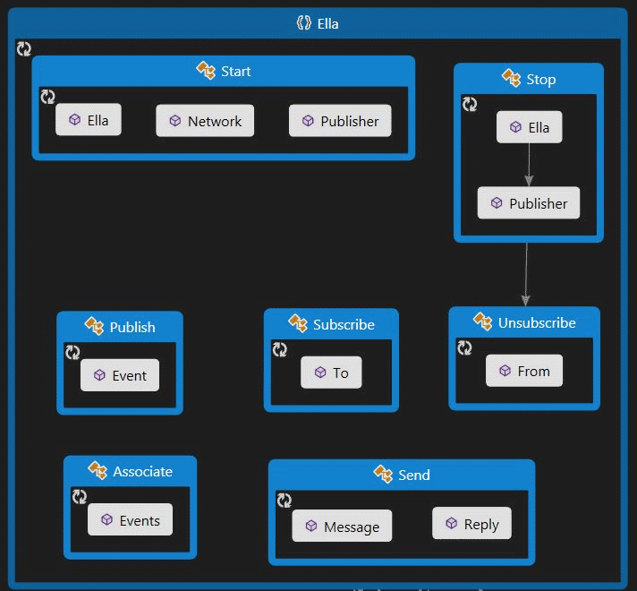

# The Facade
If you are developing a module or an application based on Ella, the facade is your place to start.

Accessing Ella-related functions is meant to be as easy and intuitive as possible. To support this, we have decided to use a static [facade](http://en.wikipedia.org/wiki/Facade_pattern) for it.

One important thing when using this middleware is that you do not need to care about holding an instance of Ella in order to access it. Instead, you just call some static methods and Ella takes care of the rest.

There is a collection of public static classes in Ella as shown in the image below. We've named classes and methods in a way that we think is intuitive to use. There are classes related to a certain action and methods related to an object. As an example, to start a publisher you use {{Start.Publisher}}. 

## Start
The start class contains some basic functionality related to starting something.

{{Start.Ella}} should be called before accessing any other functions of the middleware.

{{Start.Network}} starts up all the networking functionality of Ella. This triggers discovery of other nodes and opening communication ports. To use Ella just on a single node without network, just do not call this method.

{{Start.Publisher}} is used to start a publisher module. It adds this publisher to the list of publishers in Ella and makes it possible for subscribers to subscribe to its events.
The following example assumes that you have created a publisher class {{DateTimePublisher}} which publishes {{System.DateTime}} values

{{
DateTimePublisher publisher=new DateTimePublisher(1000); //lets the publisher publish a DateTime struct every second

Start.Publisher(publisher); //this lets Ella know, that this module is ready to be discovered
}}

Ella will now check the publisher for validity and will process its events. Afterwarts the starting method of the publisher module will be called in a separate thread. **You do not have to start the module yourself. Ella will do that**. Your publisher just needs to declare a Start method using the {{Ella.Attributes.StartAttribute}}

**Note:** Subscribers do not need to be started.

## Stop
The {{Stop}} facade class is analogue to {{Start}}.
It is used to stop a single publisher or the whole middleware at once.

## Publish
This facade class is used by publishers to publish their data.
Our DateTimePublisher just calls 
{{
Publish.Event(DateTime.Now, this, 1);
}}

Ella needs to have the reference to the publisher in order to identify it. {{1}} is the event number (defined by the publisher itself). This is required since a publisher may publish more than one event.
After this call, Ella will find all subscribers (local and remote ones) subscribed to this publisher and will deliver the DateTime object to them.
{{Publish.Event}} has an additional optional parameter which is a list of SubscriptionHandles. This enables a publisher to publish an event to just a subset of its subscribers. More to this topic will be covered in a later part of this documentation.